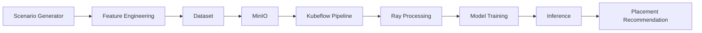

# AI-Assisted Kubernetes Scheduler

> Machine Learning--Driven Pod Placement Framework for Kubernetes


------------------------------------------------------------------------

## Overview

AI-Assisted Kubernetes Scheduler is a research-oriented scheduling
framework that explores how machine learning can augment Kubernetes
scheduling decisions. The platform combines synthetic workload
generation, feature engineering, distributed data processing, Kubeflow
Pipelines, and predictive machine learning models to investigate
intelligent pod placement strategies within Kubernetes clusters.

The project follows a modular architecture that separates dataset
generation, model training, inference, and deployment, making it
suitable for experimentation with different scheduling algorithms and
machine learning approaches.

------------------------------------------------------------------------

## Objectives

-   Explore AI-assisted scheduling for Kubernetes.
-   Generate realistic synthetic scheduling datasets.
-   Train predictive placement models.
-   Evaluate ML-assisted scheduling against heuristic approaches.
-   Build a reproducible end-to-end ML workflow.

------------------------------------------------------------------------

## High-Level Architecture



------------------------------------------------------------------------

## Workflow

1.  Generate scheduling scenarios.
2.  Extract infrastructure features.
3.  Store datasets and artifacts.
4.  Execute Kubeflow training pipeline.
5.  Train machine learning model.
6.  Persist trained model.
7.  Perform placement inference.
8.  Produce scheduling recommendations.

------------------------------------------------------------------------

## Technology Stack

  Category                 Technologies
  ------------------------ -----------------------------
  Programming              Python
  Machine Learning         Scikit-learn, Random Forest
  Orchestration            Kubernetes
  Pipeline Orchestration   Kubeflow Pipelines
  Distributed Processing   Ray
  Storage                  MinIO
  Containers               Docker
  Version Control          Git & GitHub

------------------------------------------------------------------------

## Repository Structure

``` text
AI-Assisted-Pod-Placement/
├── advisor/
├── ml/
├── kubeflow/
├── manifests/
├── scripts/
├── data/
├── Dockerfile
├── requirements.txt
└── README.md
```

------------------------------------------------------------------------

## Machine Learning Pipeline

-   Dataset generation
-   Data preprocessing
-   Feature engineering
-   Model training
-   Model serialization
-   Inference
-   Placement recommendation

The architecture has been designed to allow future integration of
additional models such as XGBoost, Gradient Boosting, and Reinforcement
Learning based schedulers.

------------------------------------------------------------------------

## Representative Features

-   CPU availability
-   Memory availability
-   CPU requests
-   Memory requests
-   Node utilization
-   Cluster load
-   Latency constraints
-   Placement locality
-   Resource violations

------------------------------------------------------------------------

## Deployment

``` bash
git clone https://github.com/kaushikrit/AI-Assisted-Pod-Placement.git

cd AI-Assisted-Pod-Placement

pip install -r requirements.txt
```

Deploy the required Kubernetes manifests and execute the Kubeflow
pipelines according to your cluster configuration.

------------------------------------------------------------------------

## Screenshots

Add screenshots here when available.

``` text
docs/images/
├── architecture.png
├── kubeflow-pipeline.png
├── ray-dashboard.png
├── model-training.png
└── results.png
```

------------------------------------------------------------------------

## Roadmap

-   Support additional ML models
-   Reinforcement learning scheduler
-   REST inference service
-   Improved evaluation metrics
-   Explainable AI
-   Multi-cluster experimentation
-   Enhanced observability
-   Dashboard integration

------------------------------------------------------------------------

## Design Principles

-   Modular architecture
-   Separation of concerns
-   Reproducible experiments
-   Scalable processing
-   Container-first deployment
-   Extensible ML workflow

------------------------------------------------------------------------

## Project Status

This repository contains an actively evolving implementation of an
AI-assisted scheduling framework. Development is ongoing with continued
improvements to dataset generation, model evaluation, deployment
workflows, and scheduling strategies.

------------------------------------------------------------------------

## Notice

This repository contains project work developed as part of an academic
and industry-sponsored initiative. Distribution or reuse of the source
code should comply with the applicable institutional and project
policies.

------------------------------------------------------------------------

## Authors

-   **Kaushik Reddy**
-   **Shanmuk**
-   **Thejeswar**
-   **Umesh**
